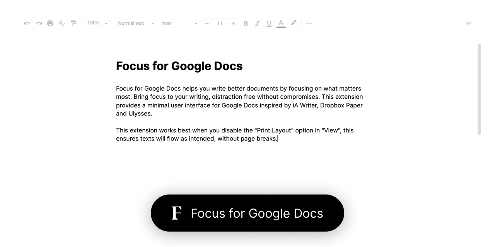

# Focus for Google Docs

Check out Focus for Google Docs in the [Chrome Web Store](https://chrome.google.com/webstore/detail/focus-for-google-docs/ehogfddbkbeoadolmjppehadlpkbmfkn)

Focus for Google Docs helps you write better documents by focusing on what matters most. Bring focus to your writing, distraction free without compromises. This extension provides a minimal user interface for Google Docs inspired by iA Writer, Dropbox Paper and Ulysses.

This extension works best when you disable the _"Print Layout"_ option in _"View"_, this ensures texts will flow as intended, without page breaks.

## How to Install in Developer Mode:

### On GitHub

1. Click on `Clone or Download` and `Download ZIP`.
2. The next step is to unzip the download.

### On Chromium based browser

3. Go to your Browser Menu and click on `More Tools` and `Extensions`.
4. In the Chrome Extensions Page you can Toggle `Developer Mode` on the top right.
5. A new set of buttons will appear: `Load unpacked`, `Pack extension` and `Update`.
6. The final step is to click on `Load unpacked` and to select the downloaded unzipped folder from GitHub.

#

Feel free to reach out to me through email at [hey@lorenzodelijser.com](mailto:hey@lorenzodelijser.com) or on [Twitter](https://twitter.com/lorenzodelijser) if you have any questions or feedback.
